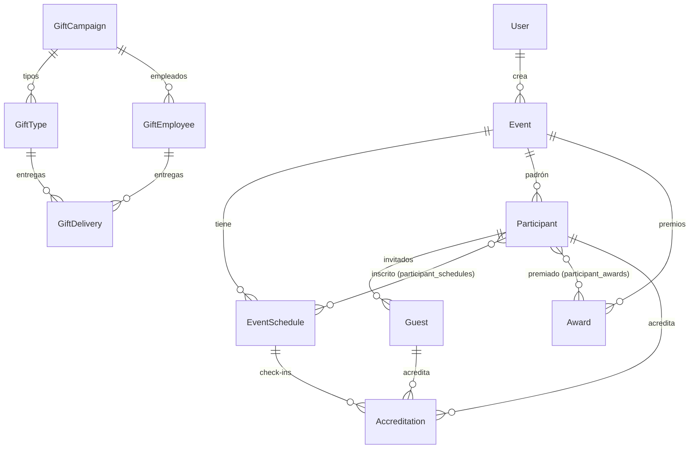

# Documentación técnica — AcreditaPro

Sistema de **acreditación de eventos** (Grupo Lo Castillo). Permite crear eventos con
fechas/horarios, cargar o inscribir participantes e invitados, acreditarlos en la puerta,
entregar premios, generar informes y gestionar campañas de regalos.

> Esta documentación describe el código **por módulos**. Cada módulo tiene su propio
> archivo en [`docs/modules/`](./modules). Empieza por este índice para el panorama
> general y salta al módulo que necesites.

---

## Índice de módulos

| Módulo | Qué cubre | Doc |
| --- | --- | --- |
| Eventos y horarios | Eventos, fechas (schedules), estados, cupo/aforo | [modules/eventos.md](./modules/eventos.md) |
| Participantes | Padrón, alta/edición/borrado, importación, búsqueda | [modules/participantes.md](./modules/participantes.md) |
| Invitados | Cargas/acompañantes (numéricos y con nombre) | [modules/invitados.md](./modules/invitados.md) |
| Acreditación | Check-in en la puerta, estadísticas, listas | [modules/acreditacion.md](./modules/acreditacion.md) |
| Premios | Premiar participantes, asignar y entregar | [modules/premios.md](./modules/premios.md) |
| Informes | Dashboard, reporte por evento, tiempo real, CSV | [modules/informes.md](./modules/informes.md) |
| Regalos Navidad | Campañas, tipos, empleados, entregas | [modules/regalos.md](./modules/regalos.md) |
| Registro público | Landings de inscripción (plantillas, modo RUT/abierto) | [modules/registro-publico.md](./modules/registro-publico.md) |
| Seguridad y Auth | Login, JWT, roles, middleware, rate-limit | [modules/seguridad-auth.md](./modules/seguridad-auth.md) |

---

## Stack

- **Next.js 16** (App Router, Turbopack) · **React 19** · **TypeScript**
- **Sequelize 6** + **PostgreSQL** (driver `pg`)
- **Zustand 5** (estado del cliente) · **Zod 4** (validación) · **react-hook-form**
- **jsonwebtoken** + **bcryptjs** (auth) · **umzug** (migraciones)
- **@emailjs/browser** (envío de correo desde el cliente) · **csv-stringify** (exportar)
- **date-fns**, **lucide-react**, **Tailwind**

## Estructura de carpetas (resumen)

```
src/
  app/
    api/            → endpoints (route.ts por recurso; App Router)
      public/       → endpoints públicos (landing de inscripción)
    (páginas)/      → dashboard, eventos, acreditación, reportes, regalos, login…
  components/       → UI por dominio (events, participants, accreditation, gifts, …)
  services/         → lógica de negocio (una clase/singleton por dominio)
  models/           → modelos Sequelize + asociaciones (index.ts)
  store/            → stores Zustand (uno por dominio)
  middleware/       → withAuth (autorización por rol)
  lib/              → sequelize, jwt, authCookie, rate-limit, env
  utils/            → validators (Zod), formatters, dietary, formFields, rut, …
migrations/         → NNNN-*.ts (umzug); orden lexicográfico = orden de aplicación
scripts/            → migrate, seed, sync-db
```

## Modelo de datos (relaciones)



**Borrado lógico (paranoid, columna `deleted_at`):** `Event`, `Participant`, `Guest`,
`User`, `EmailTemplate`. **No** paranoid (borrado real): `EventSchedule`,
`Accreditation`, `Award`, `ParticipantAward`, `ParticipantSchedule`, `RefreshToken`,
`AuditLog`, y todos los de Regalos.

## Roles y permisos

| Rol interno | Valor en BD | Nombre visible | Alcance |
| --- | --- | --- | --- |
| `ADMIN` | `ADMIN` | Administrador | Acceso total (incluye Configuración, Usuarios, Actividad) |
| `MANAGER` | `MANAGER` | Gerente | Gestión: Panel, Eventos, Participantes, Acreditación, Premios, Reportes, Regalos |
| `OPERATOR` | `OPERATOR` | Operador | Operación de eventos y participantes |
| `GUARD` | `GUARDIA` | Acreditador Eventos | Puerta: acreditar y consultar |

La autorización se aplica con `withAuth(handler, [ROLES])` (ver
[seguridad-auth.md](./modules/seguridad-auth.md)). **El rol se re-verifica contra la BD
en cada request** (el del token no es la autoridad final).

## Convenciones importantes

- **`underscored: true`** global en Sequelize: los campos camelCase del modelo mapean a
  columnas snake_case (`firstName` → `first_name`). En SQL crudo se usan nombres snake_case.
- **Validación con Zod**: los esquemas viven en `src/utils/validators/`. Los servicios
  parsean antes de escribir; el registro público valida en la ruta.
- **Migraciones (umzug)**: `migrations/NNNN-descripcion.ts` con `up`/`down`. El orden
  lexicográfico del nombre es el orden de aplicación; cada una se registra en
  `SequelizeMeta`. Ver [Despliegue](#despliegue-y-base-de-datos).
- **Auditoría**: los cambios sensibles se registran con `auditLogService.log(...)`.
- **Errores**: las rutas devuelven `{ message }` o `{ error }` con el código HTTP acorde.

## Despliegue y base de datos

Tras desplegar el código, aplicar migraciones **una vez**:

```bash
npm run db:migrate          # aplica pendientes (tsx scripts/migrate.ts up)
npm run db:migrate:status   # ver ejecutadas/pendientes sin tocar nada
```

Otros scripts: `npm run dev` (desarrollo), `npm run build` / `npm start` (producción),
`npm test` (Jest), `npm run db:seed` / `db:seed:users` (datos de ejemplo),
`npm run db:sync` (sync de esquema en desarrollo; **producción usa migraciones**).

## Mapa rápido de la API

El detalle (método, roles, qué hace) está en cada módulo. Vista general:

- **Auth** (`/api/auth/*`): login, logout, refresh, register — ver seguridad-auth.
- **Eventos** (`/api/events/**`) y **horarios** (`/schedules`): CRUD + estado.
- **Participantes** (`/api/participants/**`, `/api/events/[id]/participants`): padrón, import, búsqueda.
- **Invitados** (`/api/guests/**`, `/api/participants/[id]/guests`).
- **Acreditación** (`/api/accreditations`, `/api/accreditation/*`): check-in y estadísticas.
- **Premios** (`/api/awards/**`, `/api/participant-awards/**`, `/api/events/[id]/awards`).
- **Informes** (`/api/reports/**`).
- **Regalos** (`/api/gift-*`).
- **Público** (`/api/public/events/[slug]/*`): landing, lookup, register.
- **Otros**: `/api/users`, `/api/email-templates`, `/api/uploads`, `/api/audit-logs`, `/api/health`.
